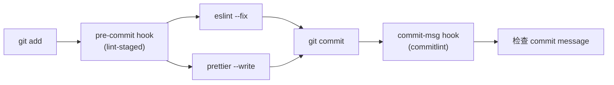

# @craig/lint-config

TypeScript / React / Vue 项目共享代码规范配置包，开箱即用。

基于 **ESLint 9 扁平化配置 (Flat Config)**，集成 Prettier、commitlint、lint-staged。

## 包含的配置

| 子路径导入                        | 说明                                                     |
| --------------------------------- | -------------------------------------------------------- |
| `@craig/lint-config/eslint`       | ESLint 基础配置 — 纯 TypeScript / JavaScript 项目        |
| `@craig/lint-config/eslint-react` | ESLint React 配置 — 基础 + React / JSX / Hooks           |
| `@craig/lint-config/eslint-vue`   | ESLint Vue 配置 — 基础 + Vue 3 SFC                       |
| `@craig/lint-config/prettier`     | Prettier 格式化规则                                      |
| `@craig/lint-config/commitlint`   | commitlint 提交信息规范（Conventional Commits）          |
| `@craig/lint-config`（主入口）    | 通用配置：基础 ESLint、Prettier、commitlint、lint-staged |

> [!IMPORTANT]
> **请始终使用子路径导入**（如 `/eslint-react`、`/eslint-vue`）。
> 主入口不含 React / Vue 配置，这是有意为之——避免纯 Vue 项目被迫加载 React 插件（反之亦然）。
> 详见下方 [为什么需要子路径导入](#为什么需要子路径导入)。

---

## 安装

### 所有项目都需要

```bash
pnpm add -D @craig/lint-config eslint prettier typescript-eslint @eslint/js globals eslint-plugin-prettier eslint-config-prettier
```

> [!NOTE]
> 使用 npm / yarn 同理，将 `pnpm add -D` 替换为 `npm install --save-dev` 或 `yarn add -D`。

### React 项目额外依赖

```bash
pnpm add -D eslint-plugin-react eslint-plugin-react-hooks eslint-plugin-react-refresh
```

### Vue 项目额外依赖

```bash
pnpm add -D eslint-plugin-vue vue-eslint-parser
```

### 可选：commitlint

```bash
pnpm add -D @commitlint/cli @commitlint/config-conventional
```

---

## 使用

### ESLint — 基础 TypeScript 项目

创建 `eslint.config.js`：

```js
import eslintConfig from "@craig/lint-config/eslint";

export default eslintConfig;
```

自定义扩展：

```js
import eslintConfig from "@craig/lint-config/eslint";

export default [
    ...eslintConfig,
    {
        rules: {
            "no-console": "warn",
            "@typescript-eslint/no-unused-vars": ["error", { argsIgnorePattern: "^_" }]
        }
    }
];
```

### ESLint — React 项目

```js
import eslintReactConfig from "@craig/lint-config/eslint-react";

export default eslintReactConfig;
```

包含的规则集：

| 规则来源                        | 说明                             |
| ------------------------------- | -------------------------------- |
| `@eslint/js` recommended        | JavaScript 最佳实践              |
| `typescript-eslint` recommended | TypeScript 规则                  |
| `eslint-plugin-react` flat      | React 核心规则 + JSX 运行时      |
| `eslint-plugin-react-hooks`     | Hooks 规则（exhaustive-deps 等） |
| `eslint-plugin-react-refresh`   | Vite HMR 导出检查                |
| `eslint-plugin-prettier`        | Prettier 集成（避免规则冲突）    |

### ESLint — Vue 项目

```js
import eslintVueConfig from "@craig/lint-config/eslint-vue";

export default eslintVueConfig;
```

包含的规则集：

| 规则来源                      | 说明                           |
| ----------------------------- | ------------------------------ |
| 基础 ESLint 全套              | JS + TS + Prettier             |
| `eslint-plugin-vue` essential | Vue 3 SFC 核心规则             |
| `vue/html-self-closing`       | 自闭合标签规范（支持自动修复） |

### Prettier

**方式一** — `package.json` 中声明（推荐，无需额外文件）：

```json
{
    "prettier": "@craig/lint-config/prettier"
}
```

**方式二** — `prettier.config.js`：

```js
import prettierConfig from "@craig/lint-config/prettier";
export default prettierConfig;
```

当前 Prettier 规则：

| 选项            | 值       |
| --------------- | -------- |
| `singleQuote`   | `false`  |
| `semi`          | `true`   |
| `tabWidth`      | `4`      |
| `useTabs`       | `false`  |
| `trailingComma` | `"none"` |
| `endOfLine`     | `"auto"` |
| `printWidth`    | `100`    |

### commitlint

创建 `commitlint.config.js`：

```js
import commitlintConfig from "@craig/lint-config/commitlint";
export default commitlintConfig;
```

配合 Husky 使用：

```bash
pnpm add -D husky
npx husky init
echo 'npx --no -- commitlint --edit $1' > .husky/commit-msg
```

提交信息格式示例：

```
feat: add user login
fix: resolve navbar overflow
docs: update API reference
chore(deps): bump typescript to 5.7
```

### lint-staged（推荐配置）

安装 `lint-staged` + `husky`：

```bash
pnpm add -D lint-staged husky
npx husky init
echo 'npx lint-staged' > .husky/pre-commit
```

创建 `lint-staged.config.js`：

```js
import { lintStagedConfig } from "@craig/lint-config";
export default lintStagedConfig;
```

等效手动配置（也可直接写在 `package.json` 中）：

```json
{
    "lint-staged": {
        "src/**/*.{js,cjs,mjs,jsx,ts,tsx,vue}": ["eslint --fix"],
        "src/**/*.{html,json,css,scss}": ["prettier --write"]
    }
}
```

### 推荐 package.json scripts

```json
{
    "scripts": {
        "lint": "eslint .",
        "lint:fix": "eslint --fix .",
        "format": "prettier --write .",
        "format:check": "prettier --check ."
    }
}
```

---

## 为什么需要子路径导入

| 导入方式                                                   | 加载的模块                                    | 纯 Vue 项目  | 纯 React 项目 |
| ---------------------------------------------------------- | --------------------------------------------- | ------------ | ------------- |
| `import cfg from "@craig/lint-config/eslint-vue"`          | `eslint.config.js` + `eslint.vue.config.js`   | ✅ 正常      | —             |
| `import cfg from "@craig/lint-config/eslint-react"`        | `eslint.config.js` + `eslint.react.config.js` | —            | ✅ 正常       |
| ~~`import { eslintVueConfig } from "@craig/lint-config"`~~ | **全部模块**（含 React 插件）                 | ❌ 报错/冗余 | ❌ 报错/冗余  |

ESM 的 `export { ... } from ...` 是**静态急切**的——只要 import 了 barrel 文件，所有 re-export 的模块都会被加载并执行顶层代码。如果 `eslint-plugin-react` 未安装，Node.js 会直接抛出 `MODULE_NOT_FOUND`。

因此主入口**仅导出无框架依赖的通用配置**，框架专属配置通过子路径按需加载，互不干扰。

---

## 完整工作流



1. `git add` 暂存文件
2. **pre-commit**：lint-staged 对暂存文件运行 ESLint + Prettier
3. **commit-msg**：commitlint 校验提交信息是否符合 Conventional Commits

---

## ESLint 规则总览

### 基础规则（所有场景共享）

- `@eslint/js` recommended
- `typescript-eslint` recommended
- `eslint-plugin-prettier` recommended（与 Prettier 集成，关闭冲突规则）
- 全局变量：`browser` + `node`
- 忽略：`*.d.ts`、`node_modules`、`dist/`、`build/`

### React 额外规则

- `eslint-plugin-react` flat/recommended + flat/jsx-runtime
- `eslint-plugin-react-hooks` recommended
- `eslint-plugin-react-refresh` only-export-components (warn)
- `settings.react.version`: `"detect"`（自动检测 React 版本）

### Vue 额外规则

- `eslint-plugin-vue` flat/essential
- `vue/html-self-closing`：强制自闭合（void 元素、组件、SVG/math 始终自闭合）

---

## 许可

MIT
